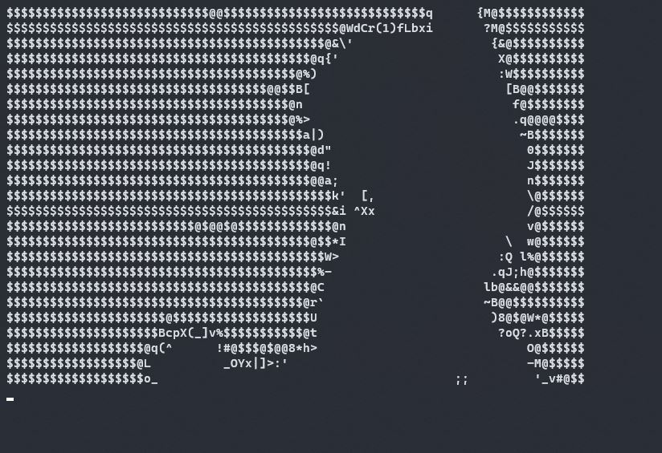

# ASCII Player
An ASCII video player for the windows terminal. The program requires a multitude of dependencies to function which can be seen in the 
[Package Requirements](#package-requirements) Section of the page. The program takes in a path argument to function, keep in mind this
is not the relative path to the video but the full path to the video. future arguments will be added in future which can be seen with 
the flag ```-h.```. To run a video through the program write:

```python ascii_video.py [video_path] ```

replace ```[video_path]``` with the path of the video.

### Todo List
- [x] output video as ASCII text
- [x] autoconversion to ASCII text
- [x] mp4 input program arguments
- [x] JSON save feature
- [x] JSON load feature
- [ ] settings

## Package Requirements
To install the dependencies needed use this command, make sure that your python installation is also added to the ```$PATH``` environment
variable in system environment variables:

```pip install -r REQUIREMENTS.txt```

Keep in mind that ASCII Video player makes no effort in installing FFmpeg as that is entirely user dependent. You can download FFmpeg [here](https://ffmpeg.org/),
keep in mind to add FFmpeg to the ```$PATH``` variable in the system environment variables.

## Sample Images

